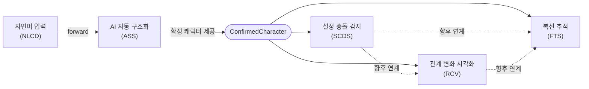

## 1. 프로젝트 개요

*Prolog*는 창작자의 자연어 입력을 구조화된 캐릭터/사건/관계 데이터로 변환하고, 이를 바탕으로 설정 충돌 감지·관계 시각화·복선 추적 등 AI 기반 창작 보조 기능을 제공하는 서비스다. 명세는 5개 기능 모듈로 나뉘며, 모두 동일한 공통 규격(Base URL, 인증, 응답 포맷)을 따른다.

| 모듈 | 약어 | 처리 방식 | 핵심 역할 |
| --- | --- | --- | --- |
| 자연어 입력 기반 캐릭터 설계 | `NLCD` | 비동기 (추출 → 폴링) | 자연어 문장에서 성격·가치관·영향관계·감정키워드 추출 |
| AI 자동 구조화 시스템 | `ASS` | 동기 (초안 CRUD) | 추출된 초안을 사용자가 편집 후 구조화 데이터로 확정·저장 |
| 설정 충돌 감지 시스템 | `SCDS` | 룰 검출(동기) + AI 분석(비동기) | 신규 사건이 기존 캐릭터 설정과 충돌하는지 감지·조언 |
| 관계 변화 시각화 | `RCV` | 완전 동기 (AI 미사용) | 캐릭터 간 관계의 챕터별 변화를 마인드맵·타임라인으로 시각화 |
| 복선 추적 시스템 | `FTS` | 완전 동기 (결정론적 템플릿) | 복선의 설치·연결·회수를 추적하고 미회수 복선을 안내 |

---

## 2. 공통 API 규격 (5개 문서 공통)

**Base URL**

```
https://api.storyforge.io/v1
```

**인증** — 모든 요청은 Bearer Token(JWT) 필요

```
Authorization: Bearer {access_token}
```

**공통 응답 포맷**

```json
// 성공
{ "data": { }, "meta": { } }

// 실패
{ "error": { "code": "...", "message": "...", "details": {} } }
```

**페이지네이션** — 커서 기반 (`limit` 기본 20/최대 100, `cursor`, 응답 `meta.next_cursor`)

<aside>
💡

AI 호출이 있는 기능(NLCD, SCDS의 분석 단계)은 **작업 생성 → 폴링** 방식의 비동기 처리로 설계됨. AI 호출이 없는 기능(RCV, FTS, ASS의 CRUD)은 **동기** 처리.

</aside>

---

## 3. 모듈 간 처리 흐름



**전체 시나리오 (피터 파커 예시로 전 문서 공통 사용)**: 자연어 입력 → NLCD 추출 → ASS 초안 편집·확정 → 확정된 캐릭터를 SCDS가 참조해 신규 사건 충돌 검사 → RCV/FTS는 별도로 관계·복선을 기록·시각화.

---

## 4. 모듈별 상세

### 4.1 자연어 입력 기반 캐릭터 설계 (NLCD)

창작자가 자연어 문장을 입력하면 AI가 성격/가치관/영향관계/감정키워드를 추출한다. 추출까지만 담당하며, 편집·확정·저장은 ASS가 담당한다 (필드명은 두 문서 간에 이미 통일되어 있어 그대로 전달 가능).

| Method | Path | 설명 |
| --- | --- | --- |
| POST | `/projects/{projectId}/nl-extractions` | 자연어 입력 제출 + 추출 요청 (비동기 시작) |
| GET | `/projects/{projectId}/nl-extractions/{extractionId}` | 추출 결과/상태 폴링 |
| POST | `/projects/{projectId}/nl-extractions/{extractionId}/retry` | AI 추출 재시도 (failed 상태에서만) |
| GET | `/projects/{projectId}/nl-extractions` | 추출 이력 목록 조회 |
| POST | `/projects/{projectId}/nl-extractions/{extractionId}/forward` | 추출 결과를 ASS로 전달 (내부적으로 ASS `POST /character-drafts` 호출) |

**주요 처리 규칙**

- 성격 태그/핵심 가치/영향관계/감정키워드는 각 항목마다 원문 근거(`evidence`)를 함께 반환
- 특정 카테고리에 해당 내용이 없으면 오류가 아니라 빈 배열 반환
- 동일/유사 문장 반복 입력 시 `duplicate_of`로 이전 추출 작업을 표시(추출 자체는 막지 않음, 최종 병합 여부는 사용자가 결정)
- 완료(`completed`) 전 `forward` 호출 시 409 `EXTRACTION_NOT_READY`, 이미 전달된 건 재요청 시 409 `ALREADY_FORWARDED`

---

### 4.2 AI 자동 구조화 시스템 (ASS)

NLCD가 넘긴 초안을 사용자가 검토·수정한 뒤 확정하여 영구 저장한다. 확정된 데이터는 SCDS·RCV 등 다른 모듈이 참조하는 원천 데이터가 된다.

| Method | Path | 설명 |
| --- | --- | --- |
| POST | `/projects/{projectId}/character-drafts` | 초안 데이터 수신 |
| GET | `/projects/{projectId}/character-drafts` | 초안 목록 조회 |
| GET | `/projects/{projectId}/character-drafts/{draftId}` | 초안 상세 조회 |
| PATCH | `/projects/{projectId}/character-drafts/{draftId}` | 초안 최상위 필드 수정 (캐릭터 이름 등) |
| POST | `/projects/{projectId}/character-drafts/{draftId}/items` | 항목 추가 |
| PATCH | `/projects/{projectId}/character-drafts/{draftId}/items/{itemId}` | 항목 수정 |
| DELETE | `/projects/{projectId}/character-drafts/{draftId}/items/{itemId}` | 항목 삭제 |
| POST | `.../items/{itemId}/suggestions` | 항목 AI 재추천 요청 (선택, 기본 비활성화) |
| POST | `/projects/{projectId}/character-drafts/{draftId}/confirm` | 확정 및 구조화 데이터 저장 |
| POST | `/projects/{projectId}/character-drafts/{draftId}/discard` | 초안 폐기 |
| GET | `.../edit-history` | 초안 편집 이력 조회 (확정 전) |
| GET | `/projects/{projectId}/characters` | 확정된 캐릭터 목록 조회 (타 모듈 데이터 제공용) |
| GET | `/projects/{projectId}/characters/{characterId}` | 확정된 캐릭터 상세 조회 |
| GET | `/projects/{projectId}/characters/{characterId}/edit-history` | 확정 이후 편집 이력 조회 |

**주요 처리 규칙**

- 항목마다 `origin`(`ai_extracted`/`user_added`)을 구분 저장
- 확정 시 캐릭터 이름 등 필수 항목 누락이면 400 `MISSING_REQUIRED_FIELD`
- 동일 이름의 기존 확정 캐릭터가 있으면 409 `DUPLICATE_CHARACTER_CANDIDATE` → `resolution: merge|create_new`로 재요청
- AI 재추천은 대안만 제시하며, 적용은 반드시 사용자가 수정 API로 직접 확정(AI가 임의로 편집 내용을 바꾸지 않음)

<aside>
⚠️

**필드명 불일치 이슈**: ASS가 정의한 필드명(`personality_tags`, `core_values`, `influence_relations`, `emotion_keywords`)이 SCDS의 `Character` 모델 필드명(`traits`, `values`, `influences`)과 다름. ASS가 확정·저장을 담당하고 SCDS/RCV가 이를 참조하는 관계이므로, 구현 전 필드명 통일 또는 매핑 규칙 정의가 필요하다고 원문에 명시되어 있음.

</aside>

---

### 4.3 설정 충돌 감지 시스템 (SCDS)

새로 입력된 사건/행동이 기존 캐릭터 설정(가치관 등)과 충돌하는지 감지하고 AI가 조언을 생성한다.

| Method | Path | 설명 |
| --- | --- | --- |
| GET | `/projects/{projectId}/characters` | 캐릭터 목록 조회 |
| GET / PUT | `/projects/{projectId}/characters/{characterId}` | 캐릭터 상세 조회 / 설정 갱신 |
| GET | `/projects/{projectId}/world-rules` | 세계관 규칙 목록 조회 |
| GET | `/projects/{projectId}/relationships` | 관계 데이터 목록 조회 |
| POST | `/projects/{projectId}/chapters/{chapterId}/events` | 신규 사건 입력 저장 + 룰 기반 후보 검출(즉시) |
| GET | `/projects/{projectId}/conflict-checks/{checkId}` | 충돌 검사 작업 상태/결과 조회 (폴링) |
| POST | `.../conflict-checks/{checkId}/retry` | AI 분석 재시도 |
| GET | `/projects/{projectId}/conflicts` | 충돌(조언) 목록 조회 — AI 디렉터 패널 |
| GET / PATCH | `/projects/{projectId}/conflicts/{conflictId}` | 충돌 상세 조회 / 사용자 처리(수용·무시·수정) |
| GET | `/projects/{projectId}/conflicts/history` | 충돌 이력 조회 (선택) |
| POST | `/projects/{projectId}/chapters/{chapterId}/rescan` | 챕터 단위 재검사 실행 (선택) |

**처리 흐름**: 사건 저장 시 룰 엔진이 동기적으로 후보 검출 → 후보 없으면 종료(AI 미호출) → 후보 있으면 `conflict_check(status=queued)` 생성 → AI 비동기 분석 → 완료 시 `Conflict` 레코드(pending) 생성 → 사용자 수용/무시/수정 처리.

**주요 처리 규칙**

- 참조할 기존 설정이 없으면 검사 자체를 `skipped`(`NO_REFERENCE_DATA`) 처리
- AI 분석 실패 시 후보만 표시되고 조언은 미생성, 재시도 API 제공
- `ignored` 처리된 충돌은 동일 캐릭터+대상+입력 조합에 대해 재감지되지 않도록 억제

---

### 4.4 관계 변화 시각화 (RCV)

AI 호출 없이, 캐릭터 간 관계의 챕터별 상태 변화를 기록하고 마인드맵/타임라인으로 시각화한다.

| Method | Path | 설명 |
| --- | --- | --- |
| GET / POST | `/projects/{projectId}/relationships` | 관계 목록 조회 / 생성 |
| GET / DELETE | `.../relationships/{relationshipId}` | 관계 상세 조회(전체 이력 포함) / 삭제 |
| GET / POST | `.../relationships/{relationshipId}/history` | 이력(시계열) 조회 / 특정 챕터 상태 기록 추가 |
| PATCH / DELETE | `.../history/{chapter}` | 특정 챕터 이력 수정 / 삭제 |
| GET | `.../relationships/{relationshipId}/snapshot` | 특정 챕터 시점 스냅샷 조회 |
| GET | `/projects/{projectId}/relationship-mindmap` | 챕터 시점 기준 마인드맵(노드-엣지) 조회 |
| GET | `.../relationships/{relationshipId}/timeline` | 타임라인 데이터(변화 지점 포함) 조회 |
| GET | `.../relationships/{relationshipId}/metrics` | 수치 지표(신뢰도 등) 시계열 조회 (선택) |
| GET | `/projects/{projectId}/characters/{characterId}/relationships` | 캐릭터의 연결 관계 목록 (삭제 전 확인용) |

**주요 처리 규칙**

- 조회 챕터에 직접 기록이 없으면 직전 챕터 값을 이어받아 반환(`is_carried_forward: true`)
- 동일 챕터 중복 기록 시 409 `DUPLICATE_CHAPTER_RECORD` (`overwrite=true`로 재요청 시 갱신)
- 캐릭터 삭제 시 종속 관계가 남아있으면 409 `CHARACTER_HAS_DEPENDENT_RELATIONSHIPS` 반환(캐릭터 삭제 API 자체는 범위 밖)
- 챕터 슬라이더 이동 시 마인드맵/스냅샷 API를 재호출하여 타임라인과 동기화

---

### 4.5 복선 추적 시스템 (FTS)

사용자가 직접 기록하는 방식으로 복선의 설치·연결·회수를 추적한다. AI 호출이 없고, 미회수 안내는 결정론적 템플릿으로 생성한다.

| Method | Path | 설명 |
| --- | --- | --- |
| GET / POST | `/projects/{projectId}/foreshadowings` | 복선 목록 조회 / 생성 |
| GET / PATCH / DELETE | `.../foreshadowings/{id}` | 상세 조회 / 정보 수정 / 삭제 |
| POST / DELETE | `.../linked-chapters(/{chapter})` | 연결 챕터 추가 / 제거 |
| PUT / DELETE | `.../foreshadowings/{id}/payoff` | 회수 처리(회수 챕터 기록) / 회수 취소 |
| GET | `/projects/{projectId}/foreshadowings/unresolved` | 미회수 목록 조회 (경과 챕터 수 기준) |
| GET | `.../unresolved/advisories` | 미회수 안내 메시지 조회 (AI 디렉터 패널용, 템플릿 기반) |
| GET | `/projects/{projectId}/foreshadowing-timeline` | 복선 타임라인 시각화 데이터 |
| POST / DELETE | `.../links(/{targetType}/{targetId})` | 사건/캐릭터 연결 추가 / 해제 |
| GET | `/projects/{projectId}/chapters/{chapter}/foreshadowings` | 특정 챕터에 연결된 복선 조회 (챕터 삭제 전 확인용) |

**주요 처리 규칙**

- 회수 챕터가 설치 챕터보다 앞서면 400 `INVALID_PAYOFF_CHAPTER`
- 이미 미회수 상태에서 회수 취소 요청 시 409 `PAYOFF_NOT_SET`
- 유사한 복선이 이미 있어도 생성은 차단하지 않고 `meta.similar_candidates`로 후보만 안내
- 미회수 안내 우선순위(`priority`)는 경과 챕터 수 기준: 10 미만 low / 10~25 medium / 25 초과 high (제안값)
- 설치 챕터(`role: setup`)가 삭제되면 자동 삭제·재지정하지 않고 사용자에게 재지정을 요청

---

## 5. 향후 확장 고려사항 종합

| 모듈 | 확장 항목 |
| --- | --- |
| SCDS | 복선/관계 연계 참조 필드 추가, 프로젝트 전체 배치 검사, 폴링→WebSocket/SSE 전환 |
| RCV | SCDS 관계 일관성 검사 연계, 복선 참조 필드 추가, 통계 리포트, 삼각관계 등 패턴 분석 API |
| FTS | SCDS 복선-설정 일관성 검사 연계, 관계 연결 필드 추가, AI 기반 회수 시점 제안, 복선 밀도·회수율 통계 |
| ASS | 사건·관계 데이터로 초안-확정 패턴 확장, 편집 이력 되돌리기(undo), 확정 시 웹훅/이벤트 버스 연동 |
| NLCD | 음성 입력 지원, 다국어 입력, 챕터 내 사건 서술 추출로 확장 |