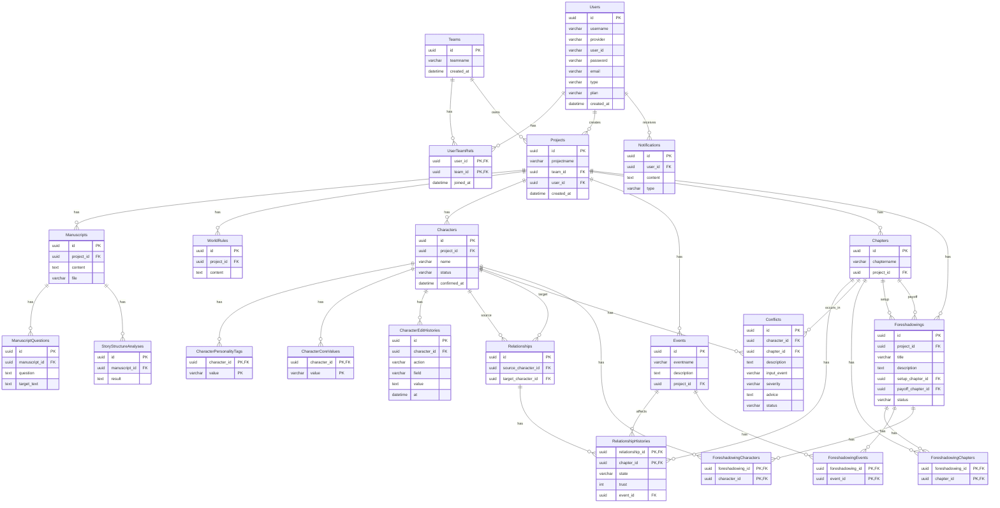

# 데이터베이스

## 데이터베이스 엔티티 추출

### 사용자 및 계정

- 사용자는 아이디, 비밀번호, 이메일, 사용자 유형을 가진다. 사용자 유형은 현직 작가, 작가 지망생, 독자로 구분한다. Google이나 Naver 등의 간편 회원가입/로그인을 사용할 수 있다.
- 어떤 플랜을 구독 중인지 상태를 저장한다.

### 팀

- 팀은 여러 사용자가 참여할 수 있으며, 팀에는 팀원과 관련된 참가 정보가 존재한다. 팀은 여러 프로젝트를 생성할 수 있다.

### 프로젝트

- 사용자는 여러 프로젝트를 생성할 수 있다. 프로젝트는 개인 프로젝트 또는 팀 프로젝트로 구분되며, 팀 프로젝트는 특정 팀에 소속된다. 프로젝트에는 여러 사용자가 참여할 수 있고, 프로젝트 내부에서 원고 및 작품 관련 데이터를 관리한다.

### 원고

- 원고는 프로젝트에 속하며, 완성된 원고 파일을 업로드하거나 프로그램 내 에디터에서 작성할 수 있다. 원고를 대상으로 AI 분석 및 질문 기능을 사용할 수 있다.

### 세계관 규칙

- 프로젝트의 원고에서 AI가 추출한 세계관의 핵심 규칙을 저장하며, 사용자가 해당 규칙을 수정할 수 있다.

### 캐릭터

- 캐릭터는 프로젝트에 속하며 이름과 함께 성격 태그, 핵심 가치를 가진다.
- 성격 태그와 핵심 가치는 여러 개를 가질 수 있고, 영향 관계는 영향을 준 대상과 관계 유형 등의 정보를 가진다. 캐릭터 데이터는 AI 추출 결과를 받은 후 사용자가 수정·삭제·추가한다.
- 검토 대기·폐기 상태가 포함된다.

### 캐릭터 편집 이력

- 사용자가 수행한 추가·수정·삭제 작업을 편집 이력으로 기록할 수 있다. 편집 이력에는 변경된 필드, 변경 값, 작업 유형, 변경 시점 등이 포함된다.

### 캐릭터 관계

- 두 캐릭터 사이의 관계를 관리하며, 관계에는 관계 대상 캐릭터와 관계 상태가 포함된다. 관계는 챕터에 따라 변화할 수 있으므로 챕터별 관계 상태 이력을 관리한다.
- 관계 이력에는 챕터, 관계 상태, 신뢰도 등의 관계 지표, 관계 변화를 유발한 사건 정보가 포함될 수 있다.

### 사건

- 스토리에서 발생하는 사건은 캐릭터 관계 변화와 설정 충돌 등의 데이터와 연결된다. 관계 변화가 발생한 챕터에는 관련 사건을 연결할 수 있으며, 복선 역시 관련 사건과 연결할 수 있다.

### 설정 충돌

- 기존 설정과 새로 입력된 내용 사이에서 발생한 충돌을 관리한다. 충돌에는 충돌 대상, 관련 캐릭터, 발생 챕터, 신규 입력 또는 사건, 심각도, AI 조언, 처리 상태가 포함된다.
- 처리 상태는 대기, 수용, 무시, 직접 수정으로 구분한다.

### 복선

- 복선은 제목과 설명을 가지며, 설치 챕터, 연결 챕터, 회수 챕터, 회수 상태를 관리한다. 복선은 관련 사건 및 캐릭터와 연결할 수 있다.
- 복선 상태는 **회수(resolved)와 미회수(unresolved)**로 구분한다.

### 챕터

- 캐릭터 관계 변화, 복선 설치·연결·회수, 설정 충돌 등의 데이터가 특정 챕터와 연결된다. 따라서 각 기능에서 챕터를 식별하고 참조할 수 있는 정보가 필요하다.

### 원고 질문

- 사용자는 원고 전체 또는 원고에서 선택한 일부를 대상으로 질문할 수 있다. 질문 기능에서는 질문 내용과 질문 대상 원고 또는 선택 텍스트를 관리한다.

### 스토리 구조 분석

- 원고에 대한 AI 스토리 분석 결과로 스토리 구조 지도를 생성하며, 해당 분석 결과는 원고 및 프로젝트와 연결된다.

### 알림

- 사용자에게 서비스 내부 알림을 제공하며, 팀 참가 등의 알림을 관리한다. 연동된 Gmail 또는 Naver 메일을 통한 알림도 지원한다.

## dbdiagram.io code

```mermaid
erDiagram
	Table Users {
	  id uuid [pk]
	  username varchar [not null]
	  provider varchar [not null]
	  user_id varchar [not null]
	  password varchar
	  email varchar
	  type varchar [not null]
	  plan varchar [not null]
	  created_at datetime
	}

	Table Teams {
	  id uuid [pk]
	  teamname varchar [not null]
	  created_at datetime
	}

	Table UserTeamRels {
	  user_id uuid [pk, ref: > Users.id]
	  team_id uuid [pk, ref: > Teams.id]
	  joined_at datetime
	}

	Table Projects {
	  id uuid [pk]
	  projectname varchar [not null]
	  team_id uuid [ref: > Teams.id]
	  user_id uuid [ref: > Users.id]
	  created_at datetime
	}

	Table Manuscripts {
	  id uuid [pk]
	  project_id uuid [ref: > Projects.id]
	  content text
	  file varchar
	}

	Table WorldRules {
	  id uuid [pk]
	  project_id uuid [ref: > Projects.id]
	  content text
	}

	Table Characters {
	  id uuid [pk]
	  project_id uuid [ref: > Projects.id]
	  name varchar [not null]
	  status varchar
	  confirmed_at datetime
	}

	Table CharacterPersonalityTags {
	  character_id uuid [pk, ref: > Characters.id]
	  value varchar [pk]
	}

	Table CharacterCoreValues {
	  character_id uuid [pk, ref: > Characters.id]
	  value varchar [pk]
	}

	Table CharacterEditHistories {
	  id uuid [pk]
	  character_id uuid [ref: > Characters.id]
	  action varchar
	  field varchar
	  value text
	  at datetime
	}

	Table Relationships {
	  id uuid [pk]
	  source_character_id uuid [ref: > Characters.id]
	  target_character_id uuid [ref: > Characters.id]
	}

	Table RelationshipHistories {
	  relationship_id uuid [pk, ref: > Relationships.id]
	  chapter_id uuid [pk, ref: > Chapters.id]
	  state varchar
	  trust int
	  event_id uuid [ref: > Events.id]
	}

	Table Events {
	  id uuid [pk]
	  eventname varchar
	  description text
	  project_id uuid [ref: > Projects.id]
	}

	Table Conflicts {
	  id uuid [pk]
	  character_id uuid [ref: > Characters.id]
	  chapter_id uuid [ref: > Chapters.id]
	  description text
	  input_event varchar
	  severity varchar
	  advice text
	  status varchar
	}

	Table Foreshadowings {
	  id uuid [pk]
	  project_id uuid [ref: > Projects.id]
	  title varchar
	  description text
	  setup_chapter_id uuid [ref: > Chapters.id]
	  payoff_chapter_id uuid [ref: > Chapters.id]
	  status varchar
	}

	Table ForeshadowingChapters {
	  foreshadowing_id uuid [pk, ref: > Foreshadowings.id]
	  chapter_id uuid [pk, ref: > Chapters.id]
	}

	Table ForeshadowingEvents {
	  foreshadowing_id uuid [pk, ref: > Foreshadowings.id]
	  event_id uuid [pk, ref: > Events.id]
	}

	Table ForeshadowingCharacters {
	  foreshadowing_id uuid [pk, ref: > Foreshadowings.id]
	  character_id uuid [pk, ref: > Characters.id]
	}

	Table Chapters {
	  id uuid [pk]
	  chaptername varchar
	  project_id uuid [ref: > Projects.id]
	}

	Table ManuscriptQuestions {
	  id uuid [pk]
	  manuscript_id uuid [ref: > Manuscripts.id]
	  question text
	  target_text text
	}

	Table StoryStructureAnalyses {
	  id uuid [pk]
	  manuscript_id uuid [ref: > Manuscripts.id]
	  result text
	}

	Table Notifications {
	  id uuid [pk]
	  user_id uuid [ref: > Users.id]
	  content text
	  type varchar
	}

```

## ERD



## Query

### DDL

```sql
-- ============================================================
-- 소설/시나리오 창작 관리 시스템 DDL
-- 대상 DBMS: PostgreSQL 13+
-- ============================================================

-- gen_random_uuid() 사용을 위한 확장 (PostgreSQL 13+ 기본 내장, 14 미만이면 아래 활성화 필요)
CREATE EXTENSION IF NOT EXISTS pgcrypto;

-- ------------------------------------------------------------
-- 1. 사용자 / 팀
-- ------------------------------------------------------------

CREATE TABLE Users (
    id          UUID         NOT NULL DEFAULT gen_random_uuid(),
    username    VARCHAR(100) NOT NULL,
    provider    VARCHAR(50),
    user_id     VARCHAR(100),
    password    VARCHAR(255),
    email       VARCHAR(255) NOT NULL,
    type        VARCHAR(50),
    plan        VARCHAR(50),
    created_at  TIMESTAMP    NOT NULL DEFAULT CURRENT_TIMESTAMP,
    PRIMARY KEY (id),
    UNIQUE (email)
);

CREATE TABLE Teams (
    id          UUID         NOT NULL DEFAULT gen_random_uuid(),
    teamname    VARCHAR(100) NOT NULL,
    created_at  TIMESTAMP    NOT NULL DEFAULT CURRENT_TIMESTAMP,
    PRIMARY KEY (id)
);

CREATE TABLE UserTeamRels (
    user_id     UUID      NOT NULL,
    team_id     UUID      NOT NULL,
    joined_at   TIMESTAMP NOT NULL DEFAULT CURRENT_TIMESTAMP,
    PRIMARY KEY (user_id, team_id),
    CONSTRAINT fk_utr_user FOREIGN KEY (user_id) REFERENCES Users(id) ON DELETE CASCADE,
    CONSTRAINT fk_utr_team FOREIGN KEY (team_id) REFERENCES Teams(id) ON DELETE CASCADE
);

-- ------------------------------------------------------------
-- 2. 프로젝트 / 알림
-- ------------------------------------------------------------

CREATE TABLE Projects (
    id          UUID         NOT NULL DEFAULT gen_random_uuid(),
    projectname VARCHAR(200) NOT NULL,
    team_id     UUID         NOT NULL,
    user_id     UUID         NOT NULL
    created_at  TIMESTAMP    NOT NULL DEFAULT CURRENT_TIMESTAMP,
    PRIMARY KEY (id),
    CONSTRAINT fk_projects_team FOREIGN KEY (team_id) REFERENCES Teams(id) ON DELETE CASCADE,
    CONSTRAINT fk_projects_user FOREIGN KEY (user_id) REFERENCES Users(id) ON DELETE RESTRICT
);

CREATE TABLE Notifications (
    id          UUID NOT NULL DEFAULT gen_random_uuid(),
    user_id     UUID NOT NULL,
    content     TEXT,
    type        VARCHAR(50),
    PRIMARY KEY (id),
    CONSTRAINT fk_notifications_user FOREIGN KEY (user_id) REFERENCES Users(id) ON DELETE CASCADE
);

-- ------------------------------------------------------------
-- 3. 프로젝트 하위 엔티티: 캐릭터 / 챕터 / 원고 / 세계관 / 사건
-- ------------------------------------------------------------

CREATE TABLE Characters (
    id           UUID         NOT NULL DEFAULT gen_random_uuid(),
    project_id   UUID         NOT NULL,
    name         VARCHAR(100) NOT NULL,
    status       VARCHAR(50),
    confirmed_at TIMESTAMP,
    PRIMARY KEY (id),
    CONSTRAINT fk_characters_project FOREIGN KEY (project_id) REFERENCES Projects(id) ON DELETE CASCADE
);

CREATE TABLE Chapters (
    id           UUID         NOT NULL DEFAULT gen_random_uuid(),
    chaptername  VARCHAR(200) NOT NULL,
    project_id   UUID         NOT NULL,
    PRIMARY KEY (id),
    CONSTRAINT fk_chapters_project FOREIGN KEY (project_id) REFERENCES Projects(id) ON DELETE CASCADE
);

CREATE TABLE Manuscripts (
    id           UUID NOT NULL DEFAULT gen_random_uuid(),
    project_id   UUID NOT NULL,
    content      TEXT,
    file         VARCHAR(500),
    PRIMARY KEY (id),
    CONSTRAINT fk_manuscripts_project FOREIGN KEY (project_id) REFERENCES Projects(id) ON DELETE CASCADE
);

CREATE TABLE WorldRules (
    id           UUID NOT NULL DEFAULT gen_random_uuid(),
    project_id   UUID NOT NULL,
    content      TEXT,
    PRIMARY KEY (id),
    CONSTRAINT fk_worldrules_project FOREIGN KEY (project_id) REFERENCES Projects(id) ON DELETE CASCADE
);

CREATE TABLE Events (
    id           UUID         NOT NULL DEFAULT gen_random_uuid(),
    eventname    VARCHAR(200) NOT NULL,
    description  TEXT,
    project_id   UUID         NOT NULL,
    PRIMARY KEY (id),
    CONSTRAINT fk_events_project FOREIGN KEY (project_id) REFERENCES Projects(id) ON DELETE CASCADE
);

-- ------------------------------------------------------------
-- 4. 캐릭터 부가 정보
-- ------------------------------------------------------------

CREATE TABLE CharacterPersonalityTags (
    character_id UUID         NOT NULL,
    value        VARCHAR(100) NOT NULL,
    PRIMARY KEY (character_id, value),
    CONSTRAINT fk_cpt_character FOREIGN KEY (character_id) REFERENCES Characters(id) ON DELETE CASCADE
);

CREATE TABLE CharacterCoreValues (
    character_id UUID         NOT NULL,
    value        VARCHAR(100) NOT NULL,
    PRIMARY KEY (character_id, value),
    CONSTRAINT fk_ccv_character FOREIGN KEY (character_id) REFERENCES Characters(id) ON DELETE CASCADE
);

CREATE TABLE CharacterEditHistories (
    id           UUID      NOT NULL DEFAULT gen_random_uuid(),
    character_id UUID      NOT NULL,
    action       VARCHAR(50),
    field        VARCHAR(100),
    value        TEXT,
    at           TIMESTAMP NOT NULL DEFAULT CURRENT_TIMESTAMP,
    PRIMARY KEY (id),
    CONSTRAINT fk_ceh_character FOREIGN KEY (character_id) REFERENCES Characters(id) ON DELETE CASCADE
);

-- ------------------------------------------------------------
-- 5. 캐릭터 관계
-- ------------------------------------------------------------

CREATE TABLE Relationships (
    id                  UUID NOT NULL DEFAULT gen_random_uuid(),
    source_character_id UUID NOT NULL,
    target_character_id UUID NOT NULL,
    PRIMARY KEY (id),
    CONSTRAINT fk_rel_source FOREIGN KEY (source_character_id) REFERENCES Characters(id) ON DELETE CASCADE,
    CONSTRAINT fk_rel_target FOREIGN KEY (target_character_id) REFERENCES Characters(id) ON DELETE CASCADE
);

-- 챕터별 관계 상태 변화 이력 (Relationships + Chapters 복합키, Events 참조)
CREATE TABLE RelationshipHistories (
    relationship_id UUID NOT NULL,
    chapter_id      UUID NOT NULL,
    state           VARCHAR(50),
    trust           INTEGER,
    event_id        UUID,
    PRIMARY KEY (relationship_id, chapter_id),
    CONSTRAINT fk_rh_relationship FOREIGN KEY (relationship_id) REFERENCES Relationships(id) ON DELETE CASCADE,
    CONSTRAINT fk_rh_chapter      FOREIGN KEY (chapter_id)      REFERENCES Chapters(id)      ON DELETE CASCADE,
    CONSTRAINT fk_rh_event        FOREIGN KEY (event_id)        REFERENCES Events(id)         ON DELETE SET NULL
);

-- ------------------------------------------------------------
-- 6. 갈등(Conflicts) - 캐릭터 x 챕터
-- ------------------------------------------------------------

CREATE TABLE Conflicts (
    id           UUID NOT NULL DEFAULT gen_random_uuid(),
    character_id UUID NOT NULL,
    chapter_id   UUID NOT NULL,
    description  TEXT,
    input_event  VARCHAR(200),
    severity     VARCHAR(50),
    advice       TEXT,
    status       VARCHAR(50),
    PRIMARY KEY (id),
    CONSTRAINT fk_conflicts_character FOREIGN KEY (character_id) REFERENCES Characters(id) ON DELETE CASCADE,
    CONSTRAINT fk_conflicts_chapter   FOREIGN KEY (chapter_id)   REFERENCES Chapters(id)   ON DELETE CASCADE
);

-- ------------------------------------------------------------
-- 7. 복선(Foreshadowings) - 설치/회수 챕터 + N:M 매핑
-- ------------------------------------------------------------

CREATE TABLE Foreshadowings (
    id                UUID         NOT NULL DEFAULT gen_random_uuid(),
    project_id        UUID         NOT NULL,
    title             VARCHAR(200) NOT NULL,
    description       TEXT,
    setup_chapter_id  UUID,
    payoff_chapter_id UUID,
    status            VARCHAR(50),
    PRIMARY KEY (id),
    CONSTRAINT fk_fs_project FOREIGN KEY (project_id)        REFERENCES Projects(id) ON DELETE CASCADE,
    CONSTRAINT fk_fs_setup   FOREIGN KEY (setup_chapter_id)  REFERENCES Chapters(id) ON DELETE SET NULL,
    CONSTRAINT fk_fs_payoff  FOREIGN KEY (payoff_chapter_id) REFERENCES Chapters(id) ON DELETE SET NULL
);

CREATE TABLE ForeshadowingChapters (
    foreshadowing_id UUID NOT NULL,
    chapter_id       UUID NOT NULL,
    PRIMARY KEY (foreshadowing_id, chapter_id),
    CONSTRAINT fk_fc_foreshadowing FOREIGN KEY (foreshadowing_id) REFERENCES Foreshadowings(id) ON DELETE CASCADE,
    CONSTRAINT fk_fc_chapter       FOREIGN KEY (chapter_id)       REFERENCES Chapters(id)       ON DELETE CASCADE
);

CREATE TABLE ForeshadowingEvents (
    foreshadowing_id UUID NOT NULL,
    event_id         UUID NOT NULL,
    PRIMARY KEY (foreshadowing_id, event_id),
    CONSTRAINT fk_fe_foreshadowing FOREIGN KEY (foreshadowing_id) REFERENCES Foreshadowings(id) ON DELETE CASCADE,
    CONSTRAINT fk_fe_event         FOREIGN KEY (event_id)         REFERENCES Events(id)         ON DELETE CASCADE
);

CREATE TABLE ForeshadowingCharacters (
    foreshadowing_id UUID NOT NULL,
    character_id     UUID NOT NULL,
    PRIMARY KEY (foreshadowing_id, character_id),
    CONSTRAINT fk_fchar_foreshadowing FOREIGN KEY (foreshadowing_id) REFERENCES Foreshadowings(id) ON DELETE CASCADE,
    CONSTRAINT fk_fchar_character     FOREIGN KEY (character_id)     REFERENCES Characters(id)     ON DELETE CASCADE
);

-- ------------------------------------------------------------
-- 8. 원고 분석 (질문 / 스토리 구조 분석)
-- ------------------------------------------------------------

CREATE TABLE ManuscriptQuestions (
    id            UUID NOT NULL DEFAULT gen_random_uuid(),
    manuscript_id UUID NOT NULL,
    question      TEXT,
    target_text   TEXT,
    PRIMARY KEY (id),
    CONSTRAINT fk_mq_manuscript FOREIGN KEY (manuscript_id) REFERENCES Manuscripts(id) ON DELETE CASCADE
);

CREATE TABLE StoryStructureAnalyses (
    id            UUID NOT NULL DEFAULT gen_random_uuid(),
    manuscript_id UUID NOT NULL,
    result        TEXT,
    PRIMARY KEY (id),
    CONSTRAINT fk_ssa_manuscript FOREIGN KEY (manuscript_id) REFERENCES Manuscripts(id) ON DELETE CASCADE
);

-- ------------------------------------------------------------
-- 참고용 인덱스 (조회 성능)
-- ------------------------------------------------------------

CREATE INDEX idx_projects_team    ON Projects(team_id);
CREATE INDEX idx_projects_user    ON Projects(user_id);
CREATE INDEX idx_characters_proj  ON Characters(project_id);
CREATE INDEX idx_chapters_proj    ON Chapters(project_id);
CREATE INDEX idx_events_proj      ON Events(project_id);
CREATE INDEX idx_conflicts_char   ON Conflicts(character_id);
CREATE INDEX idx_conflicts_chap   ON Conflicts(chapter_id);
CREATE INDEX idx_fs_proj          ON Foreshadowings(project_id);
CREATE INDEX idx_rel_source       ON Relationships(source_character_id);
CREATE INDEX idx_rel_target       ON Relationships(target_character_id);
CREATE INDEX idx_notifications_user ON Notifications(user_id);
CREATE INDEX idx_ceh_character    ON CharacterEditHistories(character_id);
CREATE INDEX idx_mq_manuscript    ON ManuscriptQuestions(manuscript_id);
CREATE INDEX idx_ssa_manuscript   ON StoryStructureAnalyses(manuscript_id);

-- ------------------------------------------------------------
-- (선택) updated_at 자동 갱신이 필요하면 트리거로 관리하는 게 일반적입니다.
-- 예시:
-- CREATE OR REPLACE FUNCTION set_updated_at() RETURNS TRIGGER AS $$
-- BEGIN
--   NEW.updated_at = CURRENT_TIMESTAMP;
--   RETURN NEW;
-- END;
-- $$ LANGUAGE plpgsql;
-- ------------------------------------------------------------

```

### DML(INSERT)

```sql
-- ============================================================
-- 테스트 데이터 삽입 스크립트 (PostgreSQL)
-- schema_postgresql.sql 실행 이후에 실행하세요.
-- FK 관계상 참조가 명확하도록 UUID를 고정값으로 지정했습니다.
-- ============================================================

BEGIN;

-- ------------------------------------------------------------
-- 1. Users / Teams / UserTeamRels
-- ------------------------------------------------------------

INSERT INTO Users (id, username, provider, user_id, password, email, type, plan, created_at) VALUES
('11111111-1111-1111-1111-111111111111', '김작가', 'google', 'gauthor01', 'hashed_pw_1', 'author1@example.com', 'general', 'pro',   '2025-01-05 09:00:00'),
('11111111-1111-1111-1111-111111111112', '이편집', 'local',  'editor02',  'hashed_pw_2', 'editor2@example.com', 'general', 'basic', '2025-01-10 10:30:00'),
('11111111-1111-1111-1111-111111111113', '박협업', 'kakao',  'collab03',  'hashed_pw_3', 'collab3@example.com', 'general', 'pro',   '2025-02-01 14:00:00');

INSERT INTO Teams (id, teamname, created_at) VALUES
('22222222-2222-2222-2222-222222222221', '판타지 창작팀',     '2025-01-05 09:10:00'),
('22222222-2222-2222-2222-222222222222', '로맨스 시나리오팀', '2025-02-01 14:10:00');

INSERT INTO UserTeamRels (user_id, team_id, joined_at) VALUES
('11111111-1111-1111-1111-111111111111', '22222222-2222-2222-2222-222222222221', '2025-01-05 09:15:00'),
('11111111-1111-1111-1111-111111111112', '22222222-2222-2222-2222-222222222221', '2025-01-11 11:00:00'),
('11111111-1111-1111-1111-111111111113', '22222222-2222-2222-2222-222222222222', '2025-02-01 14:15:00');

-- ------------------------------------------------------------
-- 2. Projects / Notifications
-- ------------------------------------------------------------

INSERT INTO Projects (id, projectname, team_id, user_id, created_at) VALUES
('33333333-3333-3333-3333-333333333331', '검은 왕관의 유산',     '22222222-2222-2222-2222-222222222221', '11111111-1111-1111-1111-111111111111', '2025-01-06 09:00:00'),
('33333333-3333-3333-3333-333333333332', '봄날의 재회',          '22222222-2222-2222-2222-222222222222', '11111111-1111-1111-1111-111111111113', '2025-02-02 10:00:00');

INSERT INTO Notifications (id, user_id, content, type) VALUES
('44444444-4444-4444-4444-444444444441', '11111111-1111-1111-1111-111111111112', '팀에 새 프로젝트가 생성되었습니다: 검은 왕관의 유산', 'project_created'),
('44444444-4444-4444-4444-444444444442', '11111111-1111-1111-1111-111111111111', '캐릭터 "라이언"에 새 편집 이력이 추가되었습니다.',   'character_updated');

-- ------------------------------------------------------------
-- 3. Characters / Chapters / Manuscripts / WorldRules / Events
-- ------------------------------------------------------------

INSERT INTO Characters (id, project_id, name, status, confirmed_at) VALUES
('55555555-5555-5555-5555-555555555551', '33333333-3333-3333-3333-333333333331', '라이언',   'confirmed', '2025-01-07 12:00:00'),
('55555555-5555-5555-5555-555555555552', '33333333-3333-3333-3333-333333333331', '세라핀',   'draft',     NULL),
('55555555-5555-5555-5555-555555555553', '33333333-3333-3333-3333-333333333332', '윤지수',   'confirmed', '2025-02-03 09:00:00'),
('55555555-5555-5555-5555-555555555554', '33333333-3333-3333-3333-333333333332', '한도윤',   'confirmed', '2025-02-03 09:05:00');

INSERT INTO Chapters (id, chaptername, project_id) VALUES
('66666666-6666-6666-6666-666666666661', '1장. 몰락한 왕국',   '33333333-3333-3333-3333-333333333331'),
('66666666-6666-6666-6666-666666666662', '2장. 붉은 서약',     '33333333-3333-3333-3333-333333333331'),
('66666666-6666-6666-6666-666666666663', '1장. 재회의 카페',   '33333333-3333-3333-3333-333333333332'),
('66666666-6666-6666-6666-666666666664', '2장. 오해의 시작',   '33333333-3333-3333-3333-333333333332');

INSERT INTO Manuscripts (id, project_id, content, file) VALUES
('77777777-7777-7777-7777-777777777771', '33333333-3333-3333-3333-333333333331', '라이언은 무너진 성벽 앞에 섰다...', '/files/manuscripts/black-crown-v1.docx'),
('77777777-7777-7777-7777-777777777772', '33333333-3333-3333-3333-333333333332', '윤지수는 3년 만에 그 카페 문을 다시 열었다...', '/files/manuscripts/spring-reunion-v1.docx');

INSERT INTO WorldRules (id, project_id, content) VALUES
('88888888-8888-8888-8888-888888888881', '33333333-3333-3333-3333-333333333331', '마법은 혈족의 인장을 가진 자만 사용할 수 있다.'),
('88888888-8888-8888-8888-888888888882', '33333333-3333-3333-3333-333333333331', '왕관은 오직 정통 후계자 앞에서만 빛을 낸다.');

INSERT INTO Events (id, eventname, description, project_id) VALUES
('99999999-9999-9999-9999-999999999991', '왕궁 습격 사건',   '반란군이 야밤에 왕궁을 기습한다.',           '33333333-3333-3333-3333-333333333331'),
('99999999-9999-9999-9999-999999999992', '카페 재회',         '윤지수와 한도윤이 우연히 같은 카페에서 재회한다.', '33333333-3333-3333-3333-333333333332');

-- ------------------------------------------------------------
-- 4. 캐릭터 부가 정보
-- ------------------------------------------------------------

INSERT INTO CharacterPersonalityTags (character_id, value) VALUES
('55555555-5555-5555-5555-555555555551', '냉철함'),
('55555555-5555-5555-5555-555555555551', '충성심'),
('55555555-5555-5555-5555-555555555552', '신비로움'),
('55555555-5555-5555-5555-555555555553', '다정함'),
('55555555-5555-5555-5555-555555555554', '무뚝뚝함');

INSERT INTO CharacterCoreValues (character_id, value) VALUES
('55555555-5555-5555-5555-555555555551', '가문의 명예'),
('55555555-5555-5555-5555-555555555552', '자유'),
('55555555-5555-5555-5555-555555555553', '진심'),
('55555555-5555-5555-5555-555555555554', '책임감');

INSERT INTO CharacterEditHistories (id, character_id, action, field, value, at) VALUES
('aaaaaaaa-aaaa-aaaa-aaaa-aaaaaaaaaaa1', '55555555-5555-5555-5555-555555555551', 'update', 'status', 'draft -> confirmed', '2025-01-07 12:00:00'),
('aaaaaaaa-aaaa-aaaa-aaaa-aaaaaaaaaaa2', '55555555-5555-5555-5555-555555555552', 'create', 'name',   '세라핀 생성',        '2025-01-06 15:00:00');

-- ------------------------------------------------------------
-- 5. 캐릭터 관계 / 관계 이력
-- ------------------------------------------------------------

INSERT INTO Relationships (id, source_character_id, target_character_id) VALUES
('bbbbbbbb-bbbb-bbbb-bbbb-bbbbbbbbbbb1', '55555555-5555-5555-5555-555555555551', '55555555-5555-5555-5555-555555555552'),
('bbbbbbbb-bbbb-bbbb-bbbb-bbbbbbbbbbb2', '55555555-5555-5555-5555-555555555553', '55555555-5555-5555-5555-555555555554');

INSERT INTO RelationshipHistories (relationship_id, chapter_id, state, trust, event_id) VALUES
('bbbbbbbb-bbbb-bbbb-bbbb-bbbbbbbbbbb1', '66666666-6666-6666-6666-666666666661', '경계', 20, '99999999-9999-9999-9999-999999999991'),
('bbbbbbbb-bbbb-bbbb-bbbb-bbbbbbbbbbb1', '66666666-6666-6666-6666-666666666662', '동맹', 60, NULL),
('bbbbbbbb-bbbb-bbbb-bbbb-bbbbbbbbbbb2', '66666666-6666-6666-6666-666666666663', '어색함', 30, '99999999-9999-9999-9999-999999999992');

-- ------------------------------------------------------------
-- 6. 갈등 (Conflicts)
-- ------------------------------------------------------------

INSERT INTO Conflicts (id, character_id, chapter_id, description, input_event, severity, advice, status) VALUES
('cccccccc-cccc-cccc-cccc-ccccccccccc1', '55555555-5555-5555-5555-555555555551', '66666666-6666-6666-6666-666666666661',
 '라이언이 가문의 명예와 개인의 자유 사이에서 갈등한다.', '왕궁 습격 사건', 'high',
 '왕관보다 세라핀과의 관계를 우선하는 선택지를 고려해보세요.', 'open'),
('cccccccc-cccc-cccc-cccc-ccccccccccc2', '55555555-5555-5555-5555-555555555554', '66666666-6666-6666-6666-666666666664',
 '한도윤이 과거의 오해를 풀지 못한 채 윤지수를 다시 마주한다.', '카페 재회', 'medium',
 '2장에서 오해의 원인이 되는 사건을 구체적으로 회상 장면으로 넣어보세요.', 'resolved');

-- ------------------------------------------------------------
-- 7. 복선 (Foreshadowings) + 매핑 테이블
-- ------------------------------------------------------------

INSERT INTO Foreshadowings (id, project_id, title, description, setup_chapter_id, payoff_chapter_id, status) VALUES
('dddddddd-dddd-dddd-dddd-ddddddddddd1', '33333333-3333-3333-3333-333333333331', '왕관의 인장',
 '1장에서 라이언의 손목에 새겨진 인장이 언급되고, 2장에서 왕관과 공명한다.',
 '66666666-6666-6666-6666-666666666661', '66666666-6666-6666-6666-666666666662', 'planted'),
('dddddddd-dddd-dddd-dddd-ddddddddddd2', '33333333-3333-3333-3333-333333333332', '잃어버린 편지',
 '1장에서 언급된 편지가 2장에서 오해의 결정적 단서로 회수된다.',
 '66666666-6666-6666-6666-666666666663', '66666666-6666-6666-6666-666666666664', 'planted');

INSERT INTO ForeshadowingChapters (foreshadowing_id, chapter_id) VALUES
('dddddddd-dddd-dddd-dddd-ddddddddddd1', '66666666-6666-6666-6666-666666666661'),
('dddddddd-dddd-dddd-dddd-ddddddddddd1', '66666666-6666-6666-6666-666666666662'),
('dddddddd-dddd-dddd-dddd-ddddddddddd2', '66666666-6666-6666-6666-666666666663'),
('dddddddd-dddd-dddd-dddd-ddddddddddd2', '66666666-6666-6666-6666-666666666664');

INSERT INTO ForeshadowingEvents (foreshadowing_id, event_id) VALUES
('dddddddd-dddd-dddd-dddd-ddddddddddd1', '99999999-9999-9999-9999-999999999991'),
('dddddddd-dddd-dddd-dddd-ddddddddddd2', '99999999-9999-9999-9999-999999999992');

INSERT INTO ForeshadowingCharacters (foreshadowing_id, character_id) VALUES
('dddddddd-dddd-dddd-dddd-ddddddddddd1', '55555555-5555-5555-5555-555555555551'),
('dddddddd-dddd-dddd-dddd-ddddddddddd2', '55555555-5555-5555-5555-555555555553'),
('dddddddd-dddd-dddd-dddd-ddddddddddd2', '55555555-5555-5555-5555-555555555554');

-- ------------------------------------------------------------
-- 8. 원고 분석 (질문 / 스토리 구조 분석)
-- ------------------------------------------------------------

INSERT INTO ManuscriptQuestions (id, manuscript_id, question, target_text) VALUES
('eeeeeeee-eeee-eeee-eeee-eeeeeeeeeee1', '77777777-7777-7777-7777-777777777771',
 '라이언이 습격 직후 왜 도망치지 않고 남았는지 동기가 명확한가요?',
 '라이언은 무너진 성벽 앞에 섰다...'),
('eeeeeeee-eeee-eeee-eeee-eeeeeeeeeee2', '77777777-7777-7777-7777-777777777772',
 '윤지수가 3년 만에 카페를 다시 연 이유가 본문에 충분히 드러나 있나요?',
 '윤지수는 3년 만에 그 카페 문을 다시 열었다...');

INSERT INTO StoryStructureAnalyses (id, manuscript_id, result) VALUES
('ffffffff-ffff-ffff-ffff-fffffffffff1', '77777777-7777-7777-7777-777777777771',
 '기승전결 중 "승" 단계에서 갈등 고조가 다소 급격함. 왕궁 습격 이후 감정선 보강 필요.'),
('ffffffff-ffff-ffff-ffff-fffffffffff2', '77777777-7777-7777-7777-777777777772',
 '전체적으로 재회-갈등-화해 구조가 명확하나, 2장 오해 파트의 개연성 보강 권장.');

COMMIT;

```

### DML(SELECT, UPDATE)

```sql
-- ============================================================
-- 전체 테이블 SELECT 쿼리 (PostgreSQL)
-- 모든 컬럼(*) 조회
-- ============================================================

SELECT * FROM Users;
SELECT * FROM Teams;
SELECT * FROM UserTeamRels;

SELECT * FROM Projects;

update Projects set user_id = null where id = '33333333-3333-3333-3333-333333333331';
update Projects set team_id = null where id = '33333333-3333-3333-3333-333333333332';

SELECT * FROM Notifications;

SELECT * FROM Characters;
SELECT * FROM Chapters;
SELECT * FROM Manuscripts;
SELECT * FROM WorldRules;
SELECT * FROM Events;

SELECT * FROM CharacterPersonalityTags;
SELECT * FROM CharacterCoreValues;
SELECT * FROM CharacterEditHistories;

SELECT * FROM Relationships;
SELECT * FROM RelationshipHistories;

SELECT * FROM Conflicts;

update Conflicts set input_event = '99999999-9999-9999-9999-999999999991' where id = 'cccccccc-cccc-cccc-cccc-ccccccccccc1';
update Conflicts set input_event = '99999999-9999-9999-9999-999999999992' where id = 'cccccccc-cccc-cccc-cccc-ccccccccccc2';

-- *****
alter table Conflicts alter column input_event type uuid using input_event::uuid;
alter table Conflicts add constraint fk_conflict_event foreign key (input_event) references events(id);

update Conflicts set description = '혈족의 인장을 가지고 있었던 라이언이 마법을 사용하지 못 함.' where id = 'cccccccc-cccc-cccc-cccc-ccccccccccc1';
update Conflicts set description = '세라핀 앞에서 왕관이 빛을 냈었지만, 이후에 세라핀이 정통 후계자가 아님이 밝혀짐.' where id = 'cccccccc-cccc-cccc-cccc-ccccccccccc2';
update Conflicts set chapter_id = '66666666-6666-6666-6666-666666666662' where id = 'cccccccc-cccc-cccc-cccc-ccccccccccc2';

update Conflicts set advice = '혈족의 인장의 능력 부여에 대한 예외 사항을 추가해보세요.' where id = 'cccccccc-cccc-cccc-cccc-ccccccccccc1';
update Conflicts set advice = '사실 세라핀과 함께 있던 크레튼이 정통 후계자임을 예상보다 빨리 공개해보세요.' where id = 'cccccccc-cccc-cccc-cccc-ccccccccccc2';

SELECT * FROM Foreshadowings;
SELECT * FROM ForeshadowingChapters;
SELECT * FROM ForeshadowingEvents;
SELECT * FROM ForeshadowingCharacters;

SELECT * FROM ManuscriptQuestions;

update ManuscriptQuestions set question = '라이언이 습격 직후 왜 도망치지 않고 남았는지에 대한 명확한 동기로 뭘 제시하는 게 좋을까?' where id = 'eeeeeeee-eeee-eeee-eeee-eeeeeeeeeee1';
update ManuscriptQuestions set question = '윤지수가 3년 만에 카페를 다시 연 이유가 본문에 충분히 드러나 있는지 한 번 검토해줄래?' where id = 'eeeeeeee-eeee-eeee-eeee-eeeeeeeeeee2';

SELECT * FROM StoryStructureAnalyses;

update StoryStructureAnalyses set result =
'{
  "structure_type": "three_act",
  "overall_summary": "왕좌를 둘러싼 배신과 회복의 여정을 그리는 3막 구조. 2막 중반 갈등 고조가 급격해 감정선 보강이 필요함.",
  "acts": [
    {
      "act": 1,
      "title": "몰락",
      "chapters": ["1장. 몰락한 왕국"],
      "summary": "왕궁이 습격당하고 라이언이 인장을 각성한다.",
      "tension_level": 30
    },
    {
      "act": 2,
      "title": "서약과 시련",
      "chapters": ["2장. 붉은 서약"],
      "summary": "라이언과 세라핀이 동맹을 맺지만 왕관의 힘이 폭주할 위험에 놓인다.",
      "tension_level": 75
    },
    {
      "act": 3,
      "title": "회복",
      "chapters": [],
      "summary": "아직 집필되지 않음 - 예상 결말: 라이언의 선택과 왕국의 재건.",
      "tension_level": null
    }
  ],
  "turning_points": [
    {
      "type": "inciting_incident",
      "chapter": "1장. 몰락한 왕국",
      "description": "왕궁 습격 사건 발생"
    },
    {
      "type": "midpoint",
      "chapter": "2장. 붉은 서약",
      "description": "라이언과 세라핀의 동맹, 왕관과 인장의 공명"
    }
  ],
  "foreshadowing_links": [
    {
      "foreshadowing_id": "dddddddd-dddd-dddd-dddd-ddddddddddd1",
      "title": "왕관의 인장",
      "setup_chapter": "1장. 몰락한 왕국",
      "payoff_chapter": "2장. 붉은 서약",
      "resolved": true
    }
  ],
  "issues": [
    {
      "severity": "medium",
      "location": "2장. 붉은 서약",
      "note": "갈등 고조가 급격함. 감정선 보강 필요."
    }
  ],
  "analyzed_at": "2025-03-01T10:00:00+09:00",
  "model_version": "story-analyzer-v2.1"
}'
where id = 'ffffffff-ffff-ffff-ffff-fffffffffff1';

update StoryStructureAnalyses set result =
'{
  "structure_type": "kishotenketsu",
  "overall_summary": "재회-오해-화해로 이어지는 전형적 로맨스 구조. 오해 파트의 개연성 보강이 권장됨.",
  "stages": [
    {
      "stage": "기",
      "label": "기",
      "chapters": ["1장. 재회의 카페"],
      "summary": "윤지수와 한도윤이 3년 만에 카페에서 재회한다.",
      "key_emotion": "설렘/어색함"
    },
    {
      "stage": "승",
      "label": "승",
      "chapters": ["2장. 오해의 시작"],
      "summary": "잃어버린 편지로 인해 과거 오해가 다시 불거진다.",
      "key_emotion": "혼란/불안"
    },
    {
      "stage": "전",
      "label": "전",
      "chapters": [],
      "summary": "미집필 - 예상: 편지의 진실이 밝혀지는 전환점",
      "key_emotion": null
    },
    {
      "stage": "결",
      "label": "결",
      "chapters": [],
      "summary": "미집필 - 예상: 화해와 재결합",
      "key_emotion": null
    }
  ],
  "relationship_arc": [
    {
      "relationship_id": "bbbbbbbb-bbbb-bbbb-bbbb-bbbbbbbbbbb2",
      "characters": ["윤지수", "한도윤"],
      "trust_curve": [
        { "chapter": "1장. 재회의 카페", "trust": 30, "state": "어색함" }
      ]
    }
  ],
  "foreshadowing_links": [
    {
      "foreshadowing_id": "dddddddd-dddd-dddd-dddd-ddddddddddd2",
      "title": "잃어버린 편지",
      "setup_chapter": "1장. 재회의 카페",
      "payoff_chapter": "2장. 오해의 시작",
      "resolved": true
    }
  ],
  "issues": [
    {
      "severity": "medium",
      "location": "2장. 오해의 시작",
      "note": "오해 발생 원인의 개연성이 부족함. 회상 장면 추가 권장."
    }
  ],
  "analyzed_at": "2025-03-02T15:30:00+09:00",
  "model_version": "story-analyzer-v2.1"
}'
where id = 'ffffffff-ffff-ffff-ffff-fffffffffff2';

alter table StoryStructureAnalyses alter column result type jsonb using result::jsonb;

```
